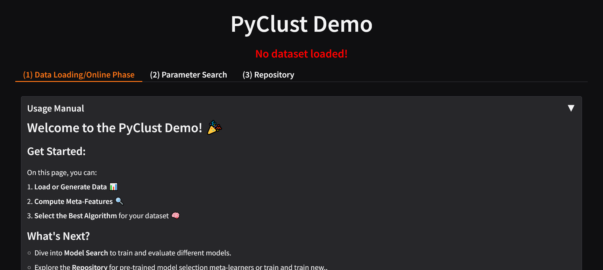

# PyClust-Demo
 
## ✏️ Overview
PyClust is a tool that enables model search, meta-learning and evaluation tools for clustering. 

- **Meta Learning** : Use one of the pretrained meta-learners for algorithm selection or train your own based on a rich 
set of state-of-the art meta-features.

- **Model Search**: Out of the box grid search implementation with easy to define parameter space in the graphical 
interface 46 Cluster validity indices as developed in the pyclustkit library. 

PyClust is built as a Python library that can be installed through PyPI, but can also be used through a Gradio-based user interface and Docker image.

## 📓 Requirements

The demo is based upon certain python libraries which are listed in the requirements.txt file. 
It is basically built on

- Gradio 
- pyclustkit

The main software needed are:

- Docker
- Python>=3.12


## 🔁 Installation

There are three ways that you can use PyClust:

- ✅ By installing PyClust library:
```comandline
pip install pyclustkit
```

PyClust offers easy to use commands to extract several meta-features from the literature
```python
from pyclustkit.metalearning import MFExtractor
mfe = MFExtractor(D).calculate_mf(category="descriptive")
```
or optimally compute internal CVIs
```python
from pyclustkit.eval import CVIToolbox
cvit = CVIToolbox(D, labels).calculate_cvi(cvi=["dunn", "silhouette"])
```

- ✅ By cloning the GitHub repository:

You can clone this repository with the following commands
```commandline
git clone https://github.com/your-username/PyClust-Demo.git  
cd PyClust-Demo   
```

and run main() ti use the Gradio-based user interface
```commandline
python main.py
```

- 🐳 Through Docker:

You can build and run the image with the following in CLI, assuming Docker is installed and running.
```commandline 
docker run -p 7861:7861 giannispoy/pyclust
```
After the successful run of the image, open a browser and go to
```commandline
localhost:7861
```
and the user interface will be accessible



## 🤝 Contributions/Contact
Contributions are welcome! Please open an issue or submit a pull request if you'd like to improve the project.

Mail us  automl.uprc@gmail.com

## Cite this Work
If you find that you have used this demo as part of your research please consider citing using the following, 

*----*
